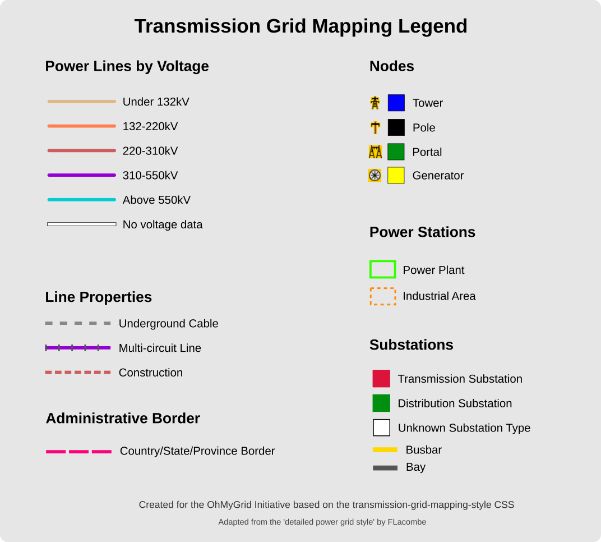

# ColorMyGrid! 🎨

Definition of default MapYourGrid MapCSS files and tools for generating customized MapCSS styles for electrical transmission networks in JOSM (Java OpenStreetMap Editor).

## 🏙️ Defaults 
 
1. Low density: For countries with a low-density grid, we recommend using a Bolt mapping style to quickly identify gaps in the grid. For denser grids, this might slow down JOSM. [ohmygrid-default-high-density.mapcss](ohmygrid-default-high-density.mapcss).
2. High density: In urban and highly developed areas, the default mapping style may slow down your mapping experience with the standard MapCSS configuration and bolt lines. [ohmygrid-default-high-density.mapcss](ohmygrid-default-high-density.mapcss).

## 📋 Tool Overview

ColorMyGrid makes it easy to create beautiful, customized MapCSS styles for mapping power infrastructure in OpenStreetMap. Designed for electrical grid mappers, this tool allows you to:

- Customize node styling, area appearances, and line widths
- Create color schemes for different voltage levels
- Choose between preset styles or fully customize your own
- Generate ready-to-use MapCSS files for JOSM

Perfect for OSM mappers focusing on electrical infrastructure, utility companies maintaining network maps, and anyone interested in visualizing power networks.

## ⚡ Features

- **Pre-defined styles**: Choose between Default or Dense network presets
- **Custom styling**: Fully customize every aspect of the style
- **Voltage-based coloring**: Define different colors for various voltage ranges
- **Zoom-dependent styling**: Specify different widths and sizes at different zoom levels
- **User-friendly interface**: Interactive command-line interface with helpful prompts

## 🔧 Installation

1. Clone this repository:
   ```
   git clone https://github.com/yourusername/color-my-grid.git
   cd color-my-grid
   ```

2. Make sure you have Python 3.6+ installed.

3. Install the required packages:
   ```
   pip install jinja2
   ```

## 🚀 Usage

1. Run the script:
   ```
   python mapcss-generator.py
   ```

2. Follow the interactive prompts to:
   - Select your template file (or use the default)
   - Choose a base style (Default, Dense, or Custom)
   - Customize style settings if desired
   - Define voltage ranges and colors
   - Name your output MapCSS file

3. Load the generated MapCSS file in JOSM:
   - In JOSM, go to `Preferences` → `Map Settings` → `Map Paint Styles`
   - Click the `+` button and select your generated file

## 📊 Style Options

### Base Styles

- **Default style**: Optimized for normal grid density areas
- **Dense network style**: Better for areas with many power features
- **Custom style**: Customize each setting yourself

### Customizable Elements

- **Node styling**: Symbol sizes at different zoom levels
- **Area styling**: Border widths and colors for substations, power plants, and generators
- **Line styling**: Line widths, casing widths for various power line types

### Voltage Rules

Define how different voltage levels appear on your map:
- Lower voltage (in volts)
- Upper voltage (in volts)
- Line color (as a hex code)
- Optional text halo color (as a hex code, defaults to #FFFFFF)

Examples: 
- `0 1000 #7B7B7B` creates a rule for 0-1000V lines in gray.
- `-1 -1 #FFFFFF` create a rul for lines without voltage in white.

## 📝 Default Structure

The tool works with MapCSS defaults that include placeholders for customizable values. The default template includes:

- Node styling rules for power infrastructure
- Area styling for substations, power plants, and generators
- Line styling for power lines, cables, and special types
- Voltage-based styling section

Placeholders are indicated with double curly braces, like: `{{basic_power_node_symbol_size_low}}`

## ❓ Troubleshooting

**Error: File not found**
- Make sure the template file exists in the specified path

**Parse errors in JOSM**
- Check if your custom colors are valid hex codes (e.g., #FF0000)
- Ensure voltage ranges don't overlap

**Styling not showing correctly**
- Verify that you've loaded the style in JOSM's Map Paint Styles settings
- Make sure the style is enabled (checked) in the list
- Toggle the style off and on again to refresh

**MapCSS Syntax Highlighter for VS Code**
- VS Code provides extentions to highlight errors in your mapcss


## 🌟 Examples

### Basic Usage

```
python mapcss-generator.py
```

Follow the prompts to create a style using the default template.

### With ohmygrid-default.mapcss default painting style as template

```
python mapcss-generator.py ohmygrid-default.mapcss
```

## 🗺️ Legend 
The quickly understand the default ohmygrid painting style a map legend is provided: 



The [original SVG file](power-grid-legend.svg) can be edited using [Inkscape](https://inkscape.org/).

## 🙏 Credits

- Original [Detailed Power Grid Style](https://josm.openstreetmap.de/wiki/Styles/Power) by FLacombe
- Adapted for transmission grid mapping by [MapYourGrid](https://mapyourgrid.org/) 

## 🔗 Related Links

- [JOSM - Java OpenStreetMap Editor](https://josm.openstreetmap.de/)
- [OSM Wiki: Power Networks](https://wiki.openstreetmap.org/wiki/Power_networks)
- [MapCSS Documentation](https://wiki.openstreetmap.org/wiki/MapCSS)

---

Made with ❤️ for the OpenStreetMap community
